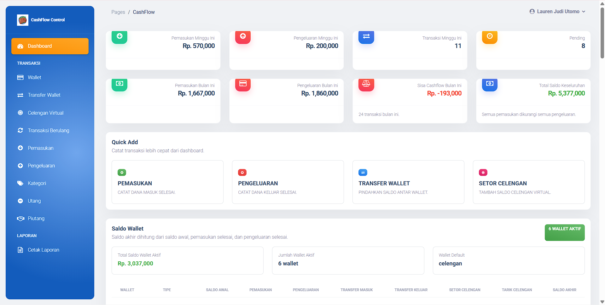
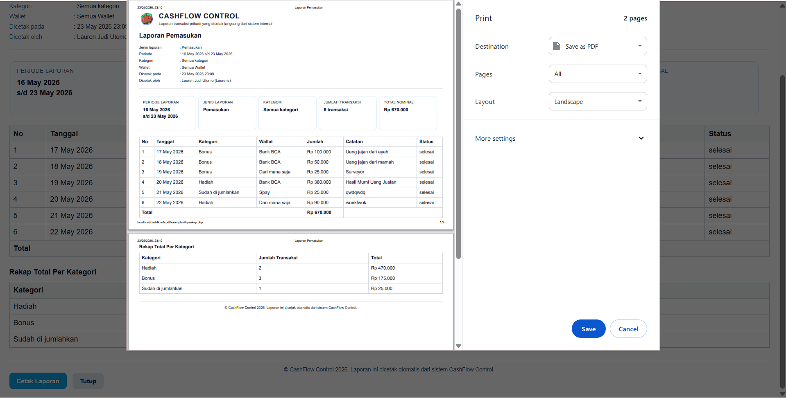
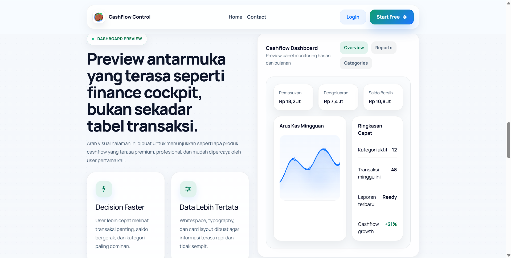
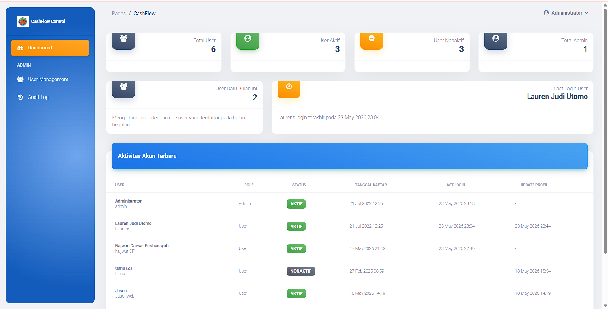
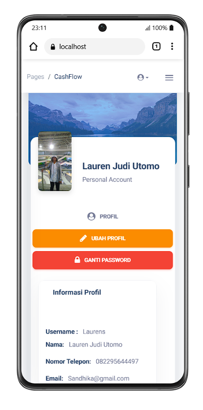

<!--
  README for CashFlow Control
  GitHub-flavored Markdown, shields.io badges, and simple HTML tables.
  Tips:
  - Put screenshots inside /img and keep the filenames used below, or update the paths.
  - Keep database/schema file updated when adding new tables or columns.
-->

<div align="center">

# 💸 CashFlow Control

### Personal finance dashboard built with PHP Native, MySQL/MariaDB, DataTables, SweetAlert, and TCPDF.

Kelola pemasukan, pengeluaran, multi-wallet, transfer saldo, budget kategori, Celengan Virtual, recurring transaction, backup data user, hingga laporan PDF/CSV dalam satu aplikasi web lokal yang ringan dan praktis.

<br>


<br>

[✨ Fitur](#-fitur-unggulan) •
[🧩 Modul](#-modul-aplikasi) •
[⚙️ Instalasi](#️-panduan-instalasi) •
[🚀 Cara Pakai](#-cara-menggunakan) •
[💾 Backup](#-backup--restore) •
[📊 Laporan](#-laporan--export)

</div>

---

## 📌 Tentang Project

**CashFlow Control** adalah aplikasi web untuk mencatat, memantau, dan mengelola arus kas pribadi secara terstruktur.

Project ini dibuat dengan **PHP Native** dan **MySQL/MariaDB**, lalu dikembangkan menjadi personal finance dashboard dengan fitur lengkap seperti **Multi-Wallet**, **Transfer Wallet**, **Budget per Kategori**, **Celengan Virtual**, **Recurring Transaction**, **Bulk Delete Desktop**, **Backup Data Per User**, dan **Laporan PDF/CSV**.

> Cocok untuk penggunaan pribadi, pencatatan keuangan harian, monitoring saldo wallet, budgeting bulanan, backup data akun, dan rekap laporan keuangan lokal menggunakan XAMPP/Laragon.

---

## ✨ Fitur Unggulan

<table>
  <tr>
    <td width="33%">
      <h3>💰 Transaksi Harian</h3>
      <p>Catat pemasukan dan pengeluaran dengan kategori, wallet, status pending/selesai, catatan, dan nominal terformat.</p>
    </td>
    <td width="33%">
      <h3>✅ Bulk Delete Desktop</h3>
      <p>Hapus banyak transaksi pemasukan/pengeluaran sekaligus melalui checkbox khusus desktop/laptop agar tetap nyaman digunakan.</p>
    </td>
    <td width="33%">
      <h3>🏦 Multi-Wallet</h3>
      <p>Kelola Cash, Bank, E-Wallet, Tabungan, dan wallet lainnya dalam satu dashboard saldo.</p>
    </td>
  </tr>
  <tr>
    <td width="33%">
      <h3>🔁 Transfer Wallet</h3>
      <p>Pindahkan saldo antar wallet tanpa dihitung sebagai pemasukan atau pengeluaran.</p>
    </td>
    <td width="33%">
      <h3>🎯 Budget Kategori</h3>
      <p>Atur budget bulanan per kategori pengeluaran dengan status pemakaian budget yang mudah dipantau.</p>
    </td>
    <td width="33%">
      <h3>🐷 Celengan Virtual</h3>
      <p>Buat target tabungan, setor dari wallet, tarik kembali ke wallet, dan pantau progress tabungan.</p>
    </td>
  </tr>
  <tr>
    <td width="33%">
      <h3>🔄 Recurring Transaction</h3>
      <p>Buat transaksi berulang untuk pemasukan atau pengeluaran rutin dengan jadwal generate otomatis/terkontrol.</p>
    </td>
    <td width="33%">
      <h3>💾 Backup Per User</h3>
      <p>Backup data per user dengan mode restore replace, cleanup data lama, transaction SQL, dan hash password tetap aman.</p>
    </td>
    <td width="33%">
      <h3>📊 Laporan PDF/CSV</h3>
      <p>Buat preview laporan, export PDF menggunakan TCPDF, dan export CSV untuk analisis spreadsheet.</p>
    </td>
  </tr>
</table>

---

## 🧩 Modul Aplikasi

| Modul | Deskripsi |
|---|---|
| 🔐 **Auth & Role** | Login, register, session guard, role admin/user, SweetAlert welcome, dan logout confirmation. |
| 🏠 **Dashboard User** | Ringkasan saldo, transaksi terbaru, insight wallet, budget, Quick Add, dan Celengan Virtual. |
| 👥 **Dashboard Admin** | Monitoring dan manajemen data pengguna. |
| 💵 **Pemasukan** | Tambah, edit, hapus, status transaksi, kategori, wallet tujuan, serta bulk delete desktop. |
| 🧾 **Pengeluaran** | Tambah, edit, hapus, status transaksi, kategori, wallet sumber, serta bulk delete desktop. |
| 🏷️ **Kategori & Budget** | Kelola kategori pemasukan/pengeluaran dan budget bulanan kategori pengeluaran. |
| 🏦 **Wallet** | Tambah/edit wallet, saldo awal, tipe wallet, default wallet, aktif/nonaktif wallet. |
| 🔁 **Transfer Wallet** | Transfer saldo antar wallet dengan validasi saldo, status, dan riwayat transfer. |
| 🐷 **Celengan Virtual** | Target tabungan, setor/tarik via wallet, progress, arsip, dan riwayat mutasi. |
| 🔄 **Recurring Transaction** | Kelola transaksi berulang untuk pemasukan/pengeluaran rutin. |
| 🤝 **Hutang & Piutang** | Pencatatan hutang/piutang, jatuh tempo, nominal, dan status pelunasan. |
| 📄 **Laporan** | Laporan pemasukan, pengeluaran, hutang, piutang, transfer, dan celengan dengan preview/PDF/CSV. |
| 💾 **Backup Data** | Backup data per user dalam format SQL restore-ready untuk dipindahkan ke device lain. |
| 👤 **Profile** | Edit profil, ganti password, dan upload foto profil dengan validasi keamanan. |

---

## 🖼️ Preview Aplikasi

> Simpan screenshot ke folder `img/` dengan nama file berikut, atau ubah path gambar sesuai kebutuhan.

<table>
  <tr>
    <td align="center" width="50%">
      
      <br>
      <b>🖥️ Dashboard Desktop</b>
      <br>
      <sub>Ringkasan wallet, budget, insight, quick add, dan transaksi terbaru.</sub>
    </td>
    <td align="center" width="50%">
      
      <br>
      <b>📄 Laporan PDF</b>
      <br>
      <sub>Preview laporan, custom date range, filter data, export PDF, dan export CSV.</sub>
    </td>
  </tr>
  <tr>
    <td align="center" width="50%">
      
      <br>
      <b>🈸 Landing Pages</b>
      <br>
      <sub>Landing page aplikasi, submit form saran, cocpyright etc..</sub>
    </td>
    <td align="center" width="50%">
      
      <br>
      <b>🧑Admin Preview</b>
      <br>
      <sub>Dashboard admin, kelola user, audit logs.</sub>
    </td>
  </tr>
  <tr>
    <td align="center" colspan="2">
      
      <br>
      <b>📱 Dashboard Mobile</b>
      <br>
      <sub>Tampilan mobile tetap ringan, bersih, dan fokus pada akses cepat.</sub>
    </td>
  </tr>
</table>

---

## 🛠️ Tech Stack

| Kategori | Teknologi |
|---|---|
| Backend | PHP Native |
| Database | MySQL / MariaDB |
| Frontend | HTML, CSS, JavaScript, jQuery |
| UI Interaction | SweetAlert, DataTables, Bootstrap-style components |
| PDF Export | TCPDF |
| Local Server | XAMPP / Laragon / WAMP / LAMP |
| Version Control | Git & GitHub |

---

## 📁 Struktur Folder

Struktur terbaru memisahkan file proses, tampilan, dan helper agar path lebih rapi dan mudah dirawat.

```text
cashflow/
├── actions/                # Handler aksi CRUD / proses data POST
├── assets/                 # CSS, JS, images, profile uploads, responsive fixes
│   ├── css/
│   ├── img/
│   └── js/
├── database/               # SQL dump database dan backup/restore sample
├── includes/               # Koneksi, navbar, sidebar, router content, helpers
├── lib/                    # Library/helper tambahan project/template
├── tcpdf/                  # Library TCPDF untuk export PDF
├── views/                  # Halaman tampilan modul aplikasi
├── index.php               # Entry point / landing
├── login.php               # Login page/process
├── register.php            # Register user
├── main.php                # Layout utama setelah login
├── .htaccess               # Routing/clean URL jika digunakan
├── .gitignore              # File/folder yang tidak ikut Git
└── README.md               # Dokumentasi project
```

> Beberapa folder legacy/template seperti `bower_components`, `css`, `fonts`, `img`, atau `js` mungkin masih ada jika template lama masih digunakan. Jangan hapus folder legacy sebelum memastikan tidak ada asset yang masih direferensikan halaman.

---

## ⚙️ Panduan Instalasi

### 1. Clone repository

```bash
git clone https://github.com/yourusername/cashflow.git
```

Atau download ZIP dari GitHub, lalu extract ke folder web server lokal.

### 2. Pindahkan ke folder local server

Untuk XAMPP:

```text
C:/xampp/htdocs/cashflow
```

Untuk Laragon:

```text
C:/laragon/www/cashflow
```

### 3. Jalankan Apache dan MySQL

Buka XAMPP/Laragon, lalu start service:

```text
Apache
MySQL
```

### 4. Buat database

Buka phpMyAdmin:

```text
http://localhost/phpmyadmin
```

Buat database baru:

```sql
CREATE DATABASE cashflow CHARACTER SET utf8mb4 COLLATE utf8mb4_general_ci;
```

### 5. Import database

Import file schema/dump utama:

```text
database/db_cashflow(default).sql
```

melalui menu **Import** di phpMyAdmin setelah database `cashflow` dibuat.

### 6. Konfigurasi koneksi database

Sesuaikan konfigurasi pada file:

```text
includes/koneksi.php
```

Contoh konfigurasi umum:

```php
$host = "localhost";
$user = "root";
$pass = "";
$db   = "cashflow";
```

> Nama variabel bisa berbeda tergantung isi file koneksi. Intinya sesuaikan host, username, password, dan nama database.

### 7. Jalankan aplikasi

Buka browser:

```text
http://localhost/cashflow/
```

Jika menggunakan clean URL via `.htaccess`, pastikan Apache module `mod_rewrite` aktif.

---

## 🚀 Cara Menggunakan

### 🧑‍💻 Untuk User

1. **Register** akun baru atau **login** ke aplikasi.
2. Buka menu **Wallet** dan pastikan memiliki minimal satu wallet aktif.
3. Buat kategori pemasukan/pengeluaran jika diperlukan.
4. Catat transaksi melalui:
   - menu **Pemasukan**,
   - menu **Pengeluaran**,
   - atau **Quick Add** dari dashboard.
5. Gunakan **Bulk Delete** pada desktop/laptop untuk menghapus beberapa pemasukan/pengeluaran sekaligus.
6. Atur budget kategori pengeluaran melalui menu **Kategori**.
7. Gunakan **Transfer Wallet** untuk memindahkan saldo antar wallet.
8. Gunakan **Celengan Virtual** untuk target tabungan.
9. Buat **Recurring Transaction** untuk transaksi rutin.
10. Pantau ringkasan melalui dashboard.
11. Cetak atau export laporan melalui menu **Laporan**.
12. Backup data user melalui menu backup/admin jika ingin memindahkan data ke device lain.

### 🛡️ Untuk Admin

1. Login sebagai admin.
2. Buka dashboard admin.
3. Kelola data pengguna.
4. Backup data user jika diperlukan.
5. Pantau aktivitas dan status user sesuai fitur yang tersedia.

---

## ⚡ Quick Add Dashboard

Dashboard user menyediakan tombol cepat untuk:

| Aksi | Fungsi |
|---|---|
| ➕ **Pemasukan** | Catat pemasukan langsung dari dashboard. |
| ➖ **Pengeluaran** | Catat pengeluaran tanpa masuk menu transaksi. |
| 🔁 **Transfer Wallet** | Pindahkan saldo antar wallet secara cepat. |
| 🐷 **Setor Celengan** | Setor dana ke Celengan Virtual dari wallet aktif. |

---

## ✅ Bulk Delete Transaksi

Fitur bulk delete tersedia untuk halaman:

- **Pemasukan**
- **Pengeluaran**

Cara kerja:

1. Buka halaman pemasukan/pengeluaran melalui desktop/laptop.
2. Centang transaksi yang ingin dihapus.
3. Klik **Hapus Terpilih**.
4. Konfirmasi melalui SweetAlert.
5. Data yang dipilih akan dihapus jika lolos validasi user dan CSRF.

> Fitur bulk delete sengaja difokuskan untuk desktop/tablet besar agar tampilan mobile tetap sederhana dan stabil. Di mobile, pengguna tetap dapat memakai tombol hapus satuan.

---

## 🏦 Rumus Saldo Wallet

Saldo wallet dihitung dari beberapa sumber:

```text
Saldo Akhir Wallet =
Saldo Awal
+ Pemasukan Selesai
- Pengeluaran Selesai
+ Transfer Masuk Selesai
- Transfer Keluar Selesai
- Setor Celengan
+ Tarik Celengan
```

Status `pending` dan `batal` tidak dihitung sebagai saldo aktual.

---

## 💾 Backup & Restore

CashFlow Control mendukung **backup data per user** dalam format SQL.

### Isi backup per user

Backup dapat menyertakan data seperti:

- user
- kategori
- budget kategori
- wallet
- pemasukan
- pengeluaran
- hutang
- piutang
- transfer wallet
- saving goal
- saving goal mutasi
- recurring transaction
- recurring generation log

### Mode restore

Backup terbaru menggunakan mode:

```text
Replace data user
```

File SQL backup akan menambahkan bagian seperti:

```sql
SET NAMES utf8mb4;
SET FOREIGN_KEY_CHECKS = 0;
START TRANSACTION;
SET @restore_user_id := <id_user>;

-- cleanup data lama user
-- insert data backup

COMMIT;
SET FOREIGN_KEY_CHECKS = 1;
```

Mode ini akan membersihkan data lama milik user tersebut terlebih dahulu, lalu memasukkan data backup agar mengurangi risiko error `Duplicate entry` saat restore.

### Cara restore ke device lain

1. Pastikan device tujuan sudah memiliki struktur database terbaru.
2. Import dahulu:

```text
database/db_cashflow(default).sql
```

3. Setelah struktur database siap, import file backup user dari panel admin.
4. Jalankan aplikasi dan login menggunakan akun user yang ikut dibackup.
5. Copy file foto profile secara manual jika ingin gambar tetap tampil.

> File backup SQL tidak menyertakan file gambar fisik. Jika user memiliki foto profil, copy file dari `assets/img/profil/` secara manual ke device tujuan.

---

## 📊 Laporan & Export

Laporan mendukung custom date range lintas hari, bulan, dan tahun.

### Jenis laporan

- 💵 Pemasukan
- 🧾 Pengeluaran
- 🤝 Hutang
- 🤲 Piutang
- 🔁 Transfer Wallet
- 🐷 Celengan Virtual

### Output laporan

| Output | Deskripsi |
|---|---|
| 👁️ Preview | Menampilkan laporan langsung di browser. |
| 📄 PDF | Export laporan formal menggunakan TCPDF. |
| 📑 CSV | Export data agar bisa dibuka di spreadsheet. |

### Filter laporan

- Tanggal awal dan tanggal akhir.
- Kategori untuk pemasukan/pengeluaran.
- Wallet untuk laporan yang relevan.

---

## 🔐 Catatan Keamanan

Beberapa bagian aplikasi sudah dilengkapi hardening:

- Validasi session login.
- Role guard admin/user.
- Validasi ownership data user.
- Prepared statement pada query penting.
- CSRF protection untuk aksi mutasi.
- Aksi hapus/status penting memakai POST.
- Bulk delete memakai POST, CSRF, validasi ownership, dan prepared statement.
- Upload foto profil divalidasi berdasarkan ekstensi, MIME type, ukuran, dan nama file aman.
- SweetAlert untuk konfirmasi aksi penting.
- Password user disimpan sebagai hash, bukan plaintext.

> Tetap gunakan aplikasi ini di environment yang aman, terutama jika masih berjalan secara lokal menggunakan XAMPP.

---

## 📱 Mobile Experience

CashFlow Control sudah dipoles agar lebih nyaman di HP:

- Dashboard dan tabel tertentu tampil sebagai card/responsive layout.
- Navbar hamburger/profile tetap mudah diakses.
- Modal input dibuat lebih nyaman untuk layar kecil.
- Tombol tambah transaksi dibuat full width pada mobile.
- Bulk delete tidak ditampilkan di mobile agar UI tetap bersih.
- Delete/edit satuan tetap tersedia untuk operasi transaksi di mobile.

---

## 🧪 Checklist Testing Setelah Install

Gunakan checklist ini setelah setup:

- [ ] Aplikasi bisa dibuka di browser.
- [ ] Register user baru berhasil.
- [ ] User baru memiliki wallet default atau bisa membuat wallet aktif.
- [ ] Login user berhasil.
- [ ] Tambah pemasukan berhasil.
- [ ] Tambah pengeluaran berhasil.
- [ ] Edit saldo awal wallet menampilkan nominal yang sesuai.
- [ ] Bulk delete pemasukan berjalan di desktop.
- [ ] Bulk delete pengeluaran berjalan di desktop.
- [ ] Tampilan mobile pemasukan/pengeluaran tetap rapi tanpa checkbox bulk.
- [ ] Quick Add dashboard berjalan.
- [ ] Transfer wallet memengaruhi saldo sesuai status.
- [ ] Celengan Virtual bisa setor/tarik via wallet.
- [ ] Budget kategori bisa disimpan.
- [ ] Recurring transaction bisa dibuat/dikelola.
- [ ] Backup SQL per user bisa digenerate.
- [ ] File backup SQL bisa diimport ke database yang sudah punya struktur terbaru.
- [ ] Laporan preview tampil.
- [ ] Export PDF berhasil.
- [ ] Export CSV berhasil.
- [ ] Login admin tidak error.

---

## 🧯 Troubleshooting

| Masalah | Solusi |
|---|---|
| Import backup user gagal `Duplicate entry` | Pastikan backup memakai mode restore `Replace data user` dan import ke struktur database terbaru. |
| Error tabel/kolom tidak ditemukan | Import `database/db_cashflow(default).sql` versi terbaru terlebih dahulu. |
| Foto profil tidak tampil setelah restore | Copy file gambar dari `assets/img/profil/` secara manual ke device tujuan. |
| Export PDF error | Pastikan folder `tcpdf/` tersedia dan path laporan tidak berubah. |
| Tampilan CSS/JS belum berubah | Hard refresh browser atau aktifkan Disable Cache di DevTools. |
| Clean URL tidak jalan | Pastikan `.htaccess` tersedia dan Apache `mod_rewrite` aktif. |
| Upload foto gagal | Pastikan ukuran file sesuai limit dan folder upload bisa ditulis. |

---

## 🗺️ Roadmap

Beberapa pengembangan yang bisa dipertimbangkan:

- [ ] Dark mode / light mode toggle.
- [ ] Grafik statistik dashboard yang lebih detail.
- [ ] Filter dashboard berdasarkan wallet.
- [ ] Restore backup langsung dari UI aplikasi.
- [ ] PWA basic untuk akses lokal/hosting HTTPS.
- [ ] Export/import asset foto profil bersama backup.
- [ ] Dokumentasi deployment hosting.
- [ ] Automated test sederhana untuk flow transaksi utama.

---

## 🤝 Kontribusi

Kontribusi sangat terbuka.

1. Fork repository.
2. Buat branch baru.

```bash
git checkout -b feature/nama-fitur
```

3. Commit perubahan.

```bash
git commit -m "Add new feature"
```

4. Push branch.

```bash
git push origin feature/nama-fitur
```

5. Buat Pull Request.

---

## 🧾 Lisensi

Project ini menggunakan lisensi **MIT**.  
Silakan gunakan, pelajari, dan modifikasi sesuai kebutuhan.

---

## 👨‍💻 Author

<div align="center">

**Najwan Caesar Firstiansyah**

[](mailto:najwan12311@gmail.com)
[](https://github.com/najwancaesar)
[](https://www.linkedin.com/in/najwan-caesar-firstiansyah-152814266/)

</div>

---

<div align="center">

### ⭐ CashFlow Control

Jika project ini bermanfaat, jangan lupa beri star di repository GitHub kamu.

**Built with passion using PHP Native + MySQL.**

</div>