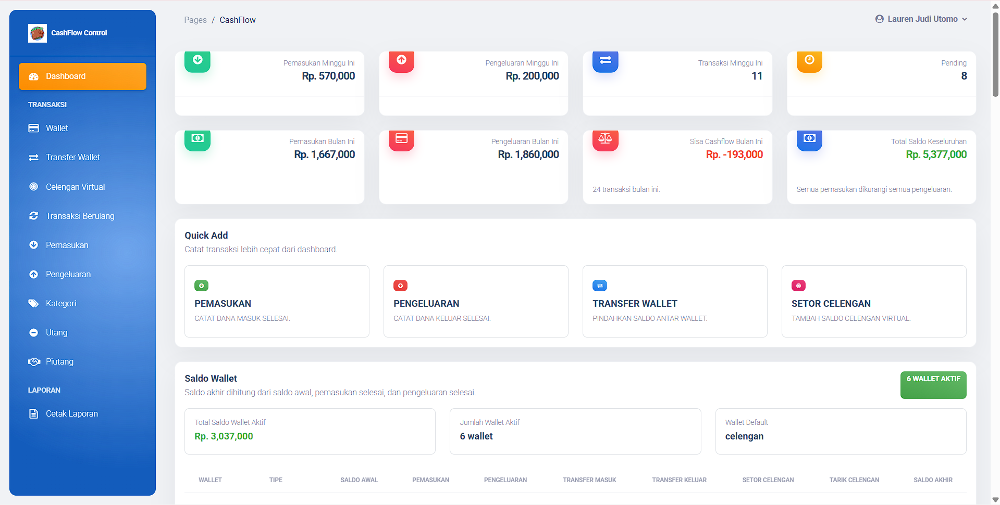
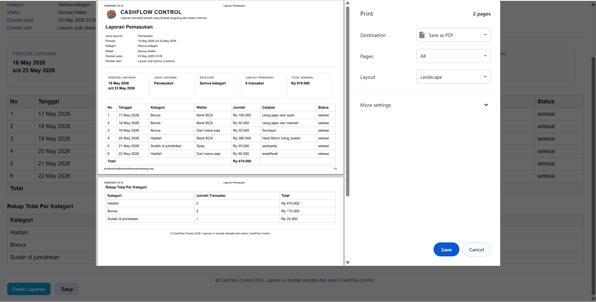
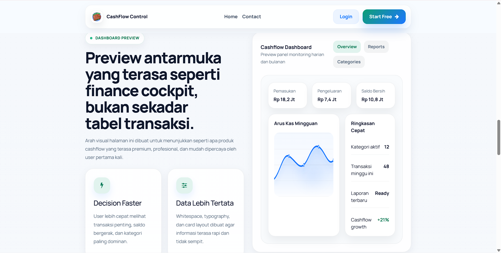
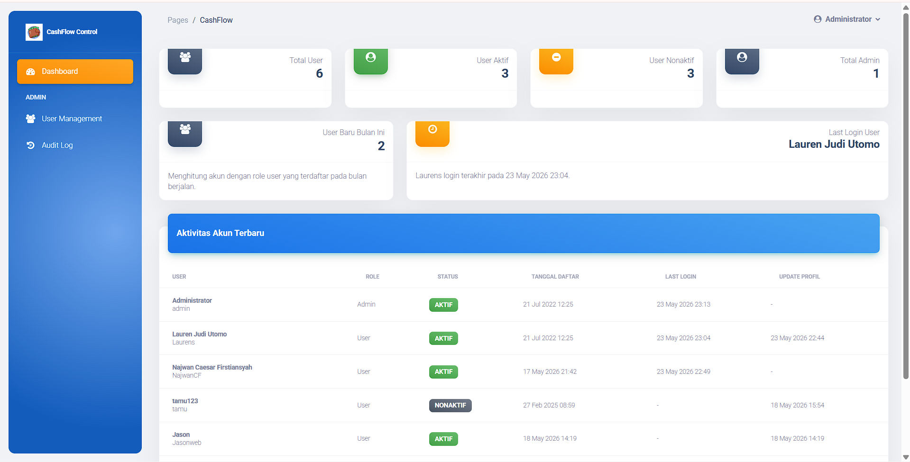
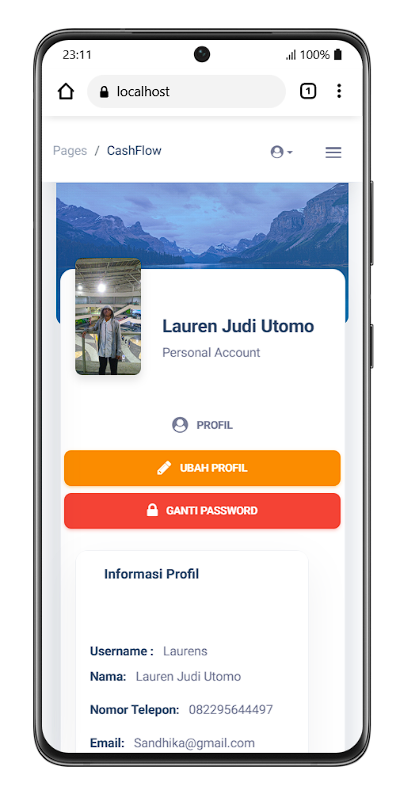

<!--
  README for CashFlow Control
  GitHub-flavored Markdown, shields.io badges, and simple HTML tables.
  Tips:
  - Put screenshots inside /img and keep the filenames used below, or update the paths.
  - Keep database/schema file updated when adding new tables or columns.
-->

<div align="center">

# 💸 CashFlow Control

### Personal finance dashboard built with PHP Native, MySQL/MariaDB, DataTables, SweetAlert, and TCPDF.

Kelola pemasukan, pengeluaran, multi-wallet, transfer saldo, budget kategori, Celengan Virtual, utang/piutang, recurring transaction, backup data user, hingga laporan PDF/CSV dalam satu aplikasi web lokal yang ringan dan praktis.

<br>


<br>

[✨ Fitur](#-fitur-unggulan) •
[🧩 Modul](#-modul-aplikasi) •
[🏦 Business Rule](#-rumus--business-rule-saldo-wallet) •
[⚙️ Instalasi](#️-panduan-instalasi) •
[🚀 Cara Pakai](#-cara-menggunakan) •
[💾 Backup](#-backup--restore) •
[📊 Laporan](#-laporan--export) •
[⚠️ Keterbatasan](#️-keterbatasan-saat-ini) •
[🗺️ Roadmap](#️-roadmap)

</div>

---

## 📌 Tentang Project

**CashFlow Control** adalah aplikasi web untuk mencatat, memantau, dan mengelola arus kas pribadi secara terstruktur.

Project ini dibuat dengan **PHP Native** dan **MySQL/MariaDB** (engine InnoDB, charset `utf8mb4`), lalu dikembangkan menjadi personal finance dashboard dengan fitur lengkap seperti **Multi-Wallet**, **Transfer Wallet**, **Budget per Kategori**, **Celengan Virtual**, **Utang & Piutang**, **Recurring Transaction**, **Kalender Keuangan**, **Backup Data Per User**, dan **Laporan PDF/CSV**.

> Cocok untuk penggunaan pribadi/keluarga, pencatatan keuangan harian, monitoring saldo multi-wallet, budgeting bulanan, backup data akun, dan rekap laporan keuangan lokal menggunakan XAMPP/Laragon — termasuk dipakai bersama di jaringan lokal (LAN) dari beberapa device.

---

## ✨ Fitur Unggulan

<table>
  <tr>
    <td width="33%">
      <h3>💰 Transaksi Harian</h3>
      <p>Catat pemasukan dan pengeluaran dengan kategori, wallet, status pending/selesai, catatan, dan nominal terformat.</p>
    </td>
    <td width="33%">
      <h3>✅ Aksi Transaksi Aman</h3>
      <p>Penghapusan tersedia untuk transaksi pending maupun selesai (transaksi selesai ikut menghapus/mengoreksi saldo terkait secara aman). Transaksi hasil auto-generate recurring atau hasil pelunasan utang/piutang tetap dilindungi dari penghapusan langsung demi menjaga histori finansial tetap utuh.</p>
    </td>
    <td width="33%">
      <h3>🏦 Multi-Wallet</h3>
      <p>Kelola Cash, Bank, E-Wallet, Kartu, Tabungan, dan tipe wallet custom lainnya dalam satu dashboard saldo.</p>
    </td>
  </tr>
  <tr>
    <td width="33%">
      <h3>🔁 Transfer Wallet</h3>
      <p>Pindahkan saldo antar wallet tanpa dihitung sebagai pemasukan atau pengeluaran.</p>
    </td>
    <td width="33%">
      <h3>🎯 Budget Kategori</h3>
      <p>Atur budget bulanan per kategori pengeluaran dengan status pemakaian budget yang mudah dipantau.</p>
    </td>
    <td width="33%">
      <h3>🐷 Celengan Virtual</h3>
      <p>Buat target tabungan, setor dari wallet, tarik kembali ke wallet, dan pantau progress tabungan.</p>
    </td>
  </tr>
  <tr>
    <td width="33%">
      <h3>🤝 Utang & Piutang</h3>
      <p>Catat utang/piutang dengan jatuh tempo, status bisa dibalik dua arah (pending ↔ lunas), dan otomatis membuat satu transaksi pemasukan/pengeluaran terhubung saat lunas — lengkap dengan kategori otomatis.</p>
    </td>
    <td width="33%">
      <h3>🔄 Recurring Transaction</h3>
      <p>Buat transaksi berulang untuk pemasukan atau pengeluaran rutin dengan jadwal generate manual dan generation log idempotent (satu template + satu periode = satu transaksi, tidak akan dobel).</p>
    </td>
    <td width="33%">
      <h3>📅 Kalender Keuangan</h3>
      <p>Pantau seluruh jatuh tempo utang/piutang/recurring dalam satu tampilan, dengan filter rentang tanggal bebas — bisa memilih periode sesuka hati, tidak terbatas per bulan.</p>
    </td>
  </tr>
  <tr>
    <td width="33%">
      <h3>💾 Backup Per User</h3>
      <p>Backup data per user dengan mode restore <em>Replace data user</em>, cleanup data lama otomatis, transaction SQL, dan hash password tetap aman.</p>
    </td>
    <td width="33%">
      <h3>📊 Laporan PDF/CSV</h3>
      <p>Buat preview laporan, export PDF menggunakan TCPDF, dan export CSV untuk analisis spreadsheet, dengan filter rentang tanggal, kategori, dan wallet.</p>
    </td>
    <td width="33%">
      <h3>🛡️ Role & Audit Log</h3>
      <p>Role user/admin terpisah, aktivitas mutasi penting tercatat ke Audit Log (khusus admin) untuk keperluan penelusuran.</p>
    </td>
  </tr>
</table>

---

## 🧩 Modul Aplikasi

| Modul | Deskripsi |
|---|---|
| 🔐 **Auth & Role** | Login, register, session guard, role admin/user, SweetAlert welcome, dan logout confirmation. |
| 🏠 **Dashboard User** | Ringkasan saldo, transaksi terbaru, insight wallet, budget, Quick Add, dan Celengan Virtual. |
| 👥 **Dashboard Admin** | Monitoring dan manajemen data pengguna. |
| 💵 **Pemasukan** | Tambah, edit, hapus (pending & selesai), status transaksi, kategori, dan wallet tujuan. |
| 🧾 **Pengeluaran** | Tambah, edit, hapus (pending & selesai), status transaksi, kategori, dan wallet sumber. |
| 🏷️ **Kategori & Budget** | Kelola kategori pemasukan/pengeluaran (termasuk kategori otomatis "Utang"/"Piutang") dan budget bulanan kategori pengeluaran. |
| 🏦 **Wallet** | Tambah/edit wallet, saldo awal, tipe wallet bawaan maupun custom, default wallet, aktif/nonaktif wallet. |
| 🔁 **Transfer Wallet** | Transfer saldo antar wallet dengan validasi saldo, status, dan riwayat transfer. |
| 🐷 **Celengan Virtual** | Target tabungan, setor/tarik via wallet, progress, dan riwayat mutasi. |
| 🔄 **Recurring Transaction** | Kelola transaksi berulang untuk pemasukan/pengeluaran rutin, generate manual per periode. |
| 📅 **Kalender Keuangan** | Agenda jatuh tempo pemasukan, pengeluaran, utang, dan piutang, dengan filter rentang tanggal bebas, jenis, dan status. |
| 🤝 **Utang & Piutang** | Pencatatan utang/piutang, jatuh tempo, nominal, status pelunasan dua arah, dan kategori otomatis saat lunas. |
| 📄 **Laporan** | Laporan pemasukan, pengeluaran, utang, piutang, transfer, dan celengan dengan preview/PDF/CSV. |
| 💾 **Backup Data** | Backup data per user dalam format SQL restore-ready untuk dipindahkan ke device lain. |
| 🛡️ **Audit Log** *(admin)* | Riwayat aktivitas/mutasi penting seluruh user untuk keperluan penelusuran. |
| 👤 **Profile** | Edit profil, ganti password, dan upload foto profil dengan validasi keamanan. |

---

## 🖼️ Preview Aplikasi

> Simpan screenshot ke folder `img/` dengan nama file berikut, atau ubah path gambar sesuai kebutuhan.

<table>
  <tr>
    <td align="center" width="50%">
      
      <br>
      <b>🖥️ Dashboard Desktop</b>
      <br>
      <sub>Ringkasan wallet, budget, insight, quick add, dan transaksi terbaru.</sub>
    </td>
    <td align="center" width="50%">
      
      <br>
      <b>📄 Laporan PDF</b>
      <br>
      <sub>Preview laporan, custom date range, filter data, export PDF & CSV.</sub>
    </td>
  </tr>
  <tr>
    <td align="center" width="50%">
      
      <br>
      <b>🈸 Landing Pages</b>
      <br>
      <sub>Landing page aplikasi, submit form saran, cocpyright etc..</sub>
    </td>
    <td align="center" width="50%">
      
      <br>
      <b>🧑Admin Preview</b>
      <br>
      <sub>Dashboard admin, kelola user, audit logs.</sub>
    </td>
  </tr>
  <tr>
    <td align="center" colspan="2">
      
      <br>
      <b>📱 Dashboard Mobile</b>
      <br>
      <sub>Tampilan mobile tetap ringan, bersih, dan fokus pada akses cepat.</sub>
    </td>
  </tr>
</table>

---

## 🛠️ Tech Stack

| Kategori | Teknologi |
|---|---|
| Backend | PHP Native (tanpa framework/Composer) |
| Database | MySQL / MariaDB — engine InnoDB, charset `utf8mb4` |
| Frontend | HTML, CSS, JavaScript, jQuery |
| UI Interaction | SweetAlert2, DataTables, Bootstrap 5 + Material Dashboard |
| PDF Export | TCPDF |
| Local Server | XAMPP / Laragon / WAMP / LAMP |
| Version Control | Git & GitHub |

---

## 📁 Struktur Folder

Struktur project memisahkan file proses, tampilan, dan helper agar path lebih rapi dan mudah dirawat. Seluruh folder legacy/template yang sebelumnya tidak terpakai (`bower_components`, `css`, `fonts`, `img`, sebagian besar `js`/`lib` di root) sudah dibersihkan — hanya aset yang benar-benar direferensikan halaman yang dipertahankan.

```text
cashflow/
├── actions/                # Handler aksi CRUD / proses data POST
├── assets/                 # CSS, JS, images, profile uploads, responsive fixes (aset AKTIF)
│   ├── css/
│   ├── img/
│   ├── js/
│   └── vendor/              # Bootstrap, DataTables, dsb — versi yang benar-benar dipakai
├── database/
│   ├── db_cashflow(default).sql   # schema + seed lengkap, single source of truth
│   └── migrations/                # riwayat migration historis (arsip/opsional rollback)
├── includes/                # Koneksi, navbar, sidebar, router content, helpers
├── lib/                     # Font Awesome (dipakai seluruh aplikasi) — jangan dihapus
├── tcpdf/                   # Library TCPDF untuk export laporan PDF
├── views/                   # Halaman tampilan per modul
├── index.php                # Entry point / landing page publik
├── login.php                # Login page/process
├── register.php             # Register user
├── main.php                 # Layout utama setelah login (session guard + router)
├── .htaccess                # Security header + clean URL opsional (lihat catatan di bawah)
└── README.md                # Dokumentasi project
```

---

## ⚙️ Panduan Instalasi

### 1. Clone repository

```bash
git clone https://github.com/yourusername/cashflow.git
```

Atau download ZIP dari GitHub, lalu extract ke folder web server lokal.

### 2. Pindahkan ke folder local server

Untuk XAMPP:

```text
C:/xampp/htdocs/cashflow
```

Untuk Laragon:

```text
C:/laragon/www/cashflow
```

### 3. Jalankan Apache dan MySQL

Buka XAMPP/Laragon, lalu start service:

```text
Apache
MySQL
```

Pastikan extension PHP `mysqli`, `mbstring`, dan `fileinfo` aktif (`fileinfo` dipakai untuk validasi upload foto profil).

### 4. Buat database

Buka phpMyAdmin:

```text
http://localhost/phpmyadmin
```

Buat database baru:

```sql
CREATE DATABASE cashflow CHARACTER SET utf8mb4 COLLATE utf8mb4_general_ci;
```

### 5. Import database

Import file schema/dump utama melalui menu **Import** di phpMyAdmin setelah database `cashflow` dibuat:

```text
database/db_cashflow(default).sql
```

> **Fresh install cukup satu langkah import ini.** Schema default sudah mencakup hasil seluruh migration yang pernah dijalankan (custom tipe wallet, kolom archive, ENUM `kartu`, serta foreign key constraint pada relasi utama) — tidak perlu menjalankan migration manual tambahan dari `database/migrations/` untuk instalasi baru. File-file migration tetap dipertahankan di repo sebagai riwayat perubahan schema.

### 6. Konfigurasi koneksi database

Sesuaikan konfigurasi pada file:

```text
includes/koneksi.php
```

Contoh konfigurasi umum:

```php
$host = "localhost";
$user = "root";
$pass = "";
$db   = "cashflow";
```

> Nama variabel bisa berbeda tergantung isi file koneksi. Intinya sesuaikan host, username, password, dan nama database. **Jangan commit password database ke repository publik.**

### 7. Jalankan aplikasi

Buka browser:

```text
http://localhost/cashflow/
```

> **Clean URL via `.htaccess` bersifat opsional.** Seluruh navigasi utama — termasuk sidebar dan redirect setelah submit form — berfungsi langsung melalui `main.php?module=xxx` tanpa bergantung pada `mod_rewrite` maupun `RewriteBase`. Aplikasi tetap berjalan normal baik diakses lewat `http://localhost/cashflow/...` maupun lewat virtual host (mis. Laragon Auto Virtual Host), tanpa perlu menyesuaikan konfigurasi `.htaccess`.

---

## 🚀 Cara Menggunakan

### 🧑‍💻 Untuk User

1. **Register** akun baru atau **login** ke aplikasi.
2. Buka menu **Wallet** dan pastikan memiliki minimal satu wallet aktif.
3. Buat kategori pemasukan/pengeluaran jika diperlukan.
4. Catat transaksi melalui:
   - menu **Pemasukan**,
   - menu **Pengeluaran**,
   - atau **Quick Add** dari dashboard.
5. Atur budget kategori pengeluaran melalui menu **Kategori**.
6. Gunakan **Transfer Wallet** untuk memindahkan saldo antar wallet.
7. Gunakan **Celengan Virtual** untuk target tabungan.
8. Catat **Utang/Piutang**, tandai lunas saat sudah dibayar/diterima (otomatis membuat transaksi terhubung dengan kategori yang sesuai), atau batalkan pelunasan bila keliru.
9. Buat **Recurring Transaction** untuk transaksi rutin.
10. Pantau jatuh tempo lewat **Kalender Keuangan** dengan rentang tanggal bebas.
11. Pantau ringkasan melalui dashboard.
12. Cetak atau export laporan melalui menu **Laporan**.
13. Backup data user melalui menu backup/admin jika ingin memindahkan data ke device lain.

### 🛡️ Untuk Admin

1. Login sebagai admin.
2. Buka dashboard admin.
3. Kelola data pengguna.
4. Pantau **Audit Log** untuk riwayat aktivitas/mutasi penting seluruh user.
5. Backup data user jika diperlukan.

---

## ⚡ Quick Add Dashboard

Dashboard user menyediakan tombol cepat untuk:

| Aksi | Fungsi |
|---|---|
| ➕ **Pemasukan** | Catat pemasukan langsung dari dashboard. |
| ➖ **Pengeluaran** | Catat pengeluaran tanpa masuk menu transaksi. |
| 🔁 **Transfer Wallet** | Pindahkan saldo antar wallet secara cepat. |
| 🐷 **Setor Celengan** | Setor dana ke Celengan Virtual dari wallet aktif. |
| 🤝 **Utang / Piutang** | Catat utang atau piutang baru secara cepat. |

---

## ✅ Penghapusan Transaksi

Penghapusan pemasukan, pengeluaran, utang, dan piutang dilakukan satu per satu melalui kolom **Aksi**, tersedia baik untuk transaksi **pending** maupun **selesai**:

- Menghapus transaksi berstatus **selesai** (termasuk utang/piutang yang sudah lunas) akan ikut mengoreksi/menghapus transaksi pemasukan/pengeluaran terkait dan menghitung ulang saldo wallet secara aman — sistem menolak penghapusan bila hasilnya akan membuat saldo wallet menjadi minus.
- Transaksi hasil **auto-generate dari Recurring Transaction**, atau transaksi pemasukan/pengeluaran hasil **pelunasan utang/piutang**, tetap dilindungi dari penghapusan langsung dari halaman tersebut demi menjaga integritas data — perubahan pada transaksi ini dilakukan lewat alur resminya (batalkan pelunasan di halaman Utang/Piutang, atau kelola template di Recurring Transaction).

Status utang/piutang juga bisa dibalik dua arah (pending ↔ lunas) baik lewat klik badge status maupun form edit, dengan pengamanan saldo yang sama.

---

## 🏦 Rumus & Business Rule Saldo Wallet

Saldo wallet dihitung **on-the-fly** (bukan dari kolom saldo tersimpan) dari rumus resmi berikut:

```text
Saldo Akhir Wallet =
Saldo Awal
+ Pemasukan Selesai
- Pengeluaran Selesai
+ Transfer Masuk Selesai
- Transfer Keluar Selesai
- Setor Celengan
+ Tarik Celengan
```

Aturan tambahan yang berlaku:

- Pemasukan/pengeluaran berstatus **pending** tidak mengubah saldo dan tidak masuk total cashflow.
- Transfer **selesai** memindahkan saldo antar-wallet, bukan dihitung sebagai cashflow baru. Transfer **pending** atau **batal** tidak mengubah saldo.
- Setor/tarik Celengan Virtual merupakan mutasi internal, bukan pemasukan/pengeluaran baru.
- Pelunasan utang membuat **satu** baris pengeluaran terhubung (kategori otomatis "Utang"); pelunasan piutang membuat **satu** baris pemasukan terhubung (kategori otomatis "Piutang"). Relasi ini dijaga 1:1.
- Template Recurring Transaction bukan transaksi itu sendiri. Satu template dan satu periode (occurrence) hanya boleh menghasilkan **satu** transaksi (idempotent, dijaga lewat generation log — tidak akan tergenerate dobel).

---

## 💾 Backup & Restore

CashFlow Control mendukung **backup data per user** dalam format SQL.

### Isi backup per user

Backup dapat menyertakan data seperti:

- user
- kategori
- budget kategori
- wallet
- pemasukan
- pengeluaran
- utang
- piutang
- transfer wallet
- saving goal
- saving goal mutasi
- recurring transaction
- recurring generation log

> **Catatan:** tipe wallet custom yang sudah dibuat user hanya ikut ter-backup di level schema (definisi tipe-nya), bukan di data backup per-user. File foto profil juga tidak termasuk dalam backup SQL — lihat langkah 5 di bawah untuk memindahkannya secara manual.

### Mode restore

Backup terbaru menggunakan mode:

```text
Replace data user
```

File SQL backup akan menyertakan bagian seperti:

```sql
SET NAMES utf8mb4;
SET FOREIGN_KEY_CHECKS = 0;
START TRANSACTION;
SET @restore_user_id := <id_user>;

-- cleanup data lama user
-- insert data backup

COMMIT;
SET FOREIGN_KEY_CHECKS = 1;
```

Mode ini akan membersihkan data lama milik user tersebut terlebih dahulu, lalu memasukkan data backup agar mengurangi risiko error `Duplicate entry` saat restore.

### Cara restore ke device lain

1. Pastikan device tujuan sudah memiliki struktur database terbaru (lihat [Panduan Instalasi](#️-panduan-instalasi) langkah 5).
2. Import dahulu `database/db_cashflow(default).sql` bila database masih kosong.
3. Setelah struktur database siap, import file backup user dari panel admin.
4. Jalankan aplikasi dan login menggunakan akun user yang ikut dibackup.
5. Copy file foto profil secara manual dari `assets/img/profil/` ke device tujuan jika ingin gambar tetap tampil.

---

## 📊 Laporan & Export

Laporan mendukung custom date range lintas hari, bulan, dan tahun.

### Jenis laporan

- 💵 Pemasukan
- 🧾 Pengeluaran
- 🤝 Utang
- 🤲 Piutang
- 🔁 Transfer Wallet
- 🐷 Celengan Virtual

### Output laporan

| Output | Deskripsi |
|---|---|
| 👁️ Preview | Menampilkan laporan langsung di browser. |
| 📄 PDF | Export laporan formal menggunakan TCPDF. |
| 📑 CSV | Export data agar bisa dibuka di spreadsheet. |

### Filter laporan

- Tanggal awal dan tanggal akhir.
- Kategori untuk pemasukan/pengeluaran.
- Wallet untuk laporan yang relevan.

---

## 🔐 Catatan Keamanan

Beberapa bagian aplikasi sudah dilengkapi hardening:

- Validasi session login pada setiap halaman & aksi.
- Role guard admin/user.
- Validasi ownership data user (query selalu difilter berdasarkan user yang login).
- Prepared statement pada seluruh query mutasi.
- CSRF protection (token per-session, verifikasi timing-safe) untuk aksi mutasi.
- Aksi hapus/ubah status penting memakai POST + CSRF + validasi ownership/status/relasi.
- Foreign key constraint di level database untuk relasi utama (wallet, kategori, user, dan relasi utang/piutang ↔ transaksi terhubung), mencegah data yatim (orphan record).
- Upload foto profil divalidasi berdasarkan ekstensi, MIME type asli (bukan cuma ekstensi), ukuran, dan nama file aman.
- SweetAlert2 untuk konfirmasi aksi penting, termasuk peringatan efek samping (mis. saat menghapus transaksi selesai atau membatalkan pelunasan).
- Password user disimpan sebagai hash (`password_hash`/bcrypt), bukan plaintext, dengan rehash otomatis saat algoritma sudah usang.

> Tetap gunakan aplikasi ini di environment yang aman, terutama jika masih berjalan secara lokal menggunakan XAMPP/Laragon di jaringan yang lebih terbuka.

---

## 📱 Mobile Experience

CashFlow Control sudah dipoles agar lebih nyaman di HP:

- Dashboard dan tabel tertentu tampil sebagai card/responsive layout.
- Navbar hamburger/profile tetap mudah diakses.
- Modal input dibuat lebih nyaman untuk layar kecil.
- Tombol tambah transaksi dibuat full width pada mobile.
- Delete/edit satuan tetap tersedia untuk transaksi yang memenuhi aturan, baik di desktop maupun mobile.
- Tabel dengan kolom banyak tetap bisa digeser (scroll horizontal) tanpa memotong toolbar di atasnya.

---

## 🧪 Checklist Testing Setelah Install

Gunakan checklist ini setelah setup:

- [ ] Aplikasi bisa dibuka di browser.
- [ ] Register user baru berhasil.
- [ ] User baru memiliki wallet default atau bisa membuat wallet aktif.
- [ ] Login user berhasil.
- [ ] Tambah pemasukan berhasil.
- [ ] Tambah pengeluaran berhasil.
- [ ] Edit saldo awal wallet menampilkan nominal yang sesuai.
- [ ] Hapus manual pemasukan (pending maupun selesai) yang eligible berjalan, saldo terkoreksi dengan benar.
- [ ] Hapus manual pengeluaran (pending maupun selesai) yang eligible berjalan, saldo terkoreksi dengan benar.
- [ ] Tandai lunas & batalkan pelunasan utang/piutang, saldo dan kategori transaksi terhubung sesuai.
- [ ] Tampilan mobile pemasukan/pengeluaran tetap rapi tanpa checkbox pemilihan massal.
- [ ] Quick Add dashboard berjalan.
- [ ] Transfer wallet memengaruhi saldo sesuai status.
- [ ] Celengan Virtual bisa setor/tarik via wallet.
- [ ] Budget kategori bisa disimpan.
- [ ] Recurring transaction bisa dibuat/dikelola, generate tidak menghasilkan duplikat.
- [ ] Kalender Keuangan bisa difilter dengan rentang tanggal bebas.
- [ ] Backup SQL per user bisa digenerate.
- [ ] File backup SQL bisa diimport ke database yang sudah punya struktur terbaru.
- [ ] Laporan preview tampil.
- [ ] Export PDF berhasil.
- [ ] Export CSV berhasil.
- [ ] Login admin tidak error, Audit Log tampil dengan benar.

---

## 🧯 Troubleshooting

| Masalah | Solusi |
|---|---|
| Import backup user gagal `Duplicate entry` | Pastikan backup memakai mode restore `Replace data user` dan import ke struktur database terbaru. |
| Error tabel/kolom tidak ditemukan | Import `database/db_cashflow(default).sql` versi terbaru terlebih dahulu. |
| Foto profil tidak tampil setelah restore | Copy file gambar dari `assets/img/profil/` secara manual ke device tujuan. |
| Export PDF error | Pastikan folder `tcpdf/` tersedia dan path laporan tidak berubah. |
| Tampilan CSS/JS belum berubah | Hard refresh browser (Ctrl+Shift+R) atau aktifkan Disable Cache di DevTools. |
| Navigasi/redirect "Not Found" | Navigasi sidebar dan redirect setelah submit form tidak bergantung pada clean URL, seharusnya selalu berfungsi via `main.php?module=xxx`. Kalau tetap terjadi, cek apakah ada penyesuaian custom pada `.htaccess`/`RewriteBase` yang mengganggu — bukan bagian dari alur normal aplikasi. |
| Upload foto gagal | Pastikan ukuran file sesuai limit dan folder upload bisa ditulis. |

---

## ⚠️ Keterbatasan Saat Ini

- Backend arsip transaksi (`aksi_archive.php`, `archive_helper.php`, kolom `archived_at`/`archived_by`) sudah tersedia di server, namun UI untuk mengarsipkan transaksi dari tampilan belum diekspos ke user.
- Tipe wallet custom yang sudah dibuat user tidak diikutkan dalam backup SQL per user (hanya tersimpan di level schema/definisi tipe).
- File foto profil tidak termasuk di dalam backup SQL — perlu dipindahkan manual (lihat [Backup & Restore](#-backup--restore)).
- Tidak ada background worker/cron bawaan; recurring transaction digenerate manual melalui flow aplikasi yang tersedia (tombol "Generate Bulan Ini"), bukan otomatis berjalan di background.
- Pengujian browser lintas perangkat (desktop, mobile, berbagai lebar layar) tetap disarankan setelah setiap perubahan CSS/JavaScript.

---

## 🗺️ Roadmap

Fitur yang sudah rampung:

- [x] Kalender Keuangan dengan filter rentang tanggal bebas.
- [x] Foreign key constraint pada relasi database utama.
- [x] Penghapusan transaksi selesai (dengan pengamanan saldo & relasi terlindungi).

Pengembangan yang bisa dipertimbangkan ke depan:

- [ ] UI untuk mengarsipkan transaksi (backend sudah siap) beserta reversal yang aman.
- [ ] Tutup buku serta rekonsiliasi periode.
- [ ] Insight dashboard yang lebih detail dan health monitoring khusus admin.
- [ ] Dark mode / light mode toggle.
- [ ] Grafik statistik dashboard yang lebih detail.
- [ ] Filter dashboard berdasarkan wallet.
- [ ] Restore backup langsung dari UI aplikasi.
- [ ] PWA basic untuk akses lokal/hosting HTTPS.
- [ ] Export/import asset foto profil bersama backup.
- [ ] Dokumentasi deployment hosting.
- [ ] Automated test sederhana untuk flow transaksi utama.

---

## 🤝 Kontribusi

Kontribusi sangat terbuka.

1. Fork repository.
2. Buat branch baru.

```bash
git checkout -b feature/nama-fitur
```

3. Commit perubahan.

```bash
git commit -m "Add new feature"
```

4. Push branch.

```bash
git push origin feature/nama-fitur
```

5. Buat Pull Request.

---

## 🧾 Lisensi

Project ini menggunakan lisensi **MIT**.
Silakan gunakan, pelajari, dan modifikasi sesuai kebutuhan.

---

## 👨‍💻 Author

<div align="center">

**Najwan Caesar Firstiansyah**

[](mailto:najwan12311@gmail.com)
[](https://github.com/najwancaesar)
[](https://www.linkedin.com/in/najwan-caesar-firstiansyah-152814266/)

</div>

---

<div align="center">

### ⭐ CashFlow Control

Jika project ini bermanfaat, jangan lupa beri star di repository GitHub kamu.

**Built with passion using PHP Native + MySQL.**

</div>