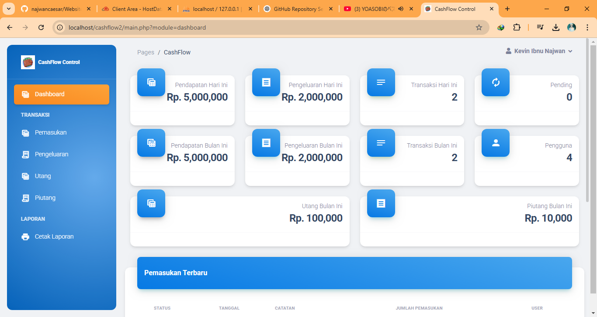

# Cashflow Management System

## Description

Cashflow Management System is a web-based application designed to track and manage financial transactions, including income, expenses, debts, and receivables. This system provides an efficient way to monitor cash flow and generate financial reports.

## Technologies Used

### Programming Languages:

- PHP (Backend Development)
- JavaScript (Client-Side Scripting)
- CSS (Styling)
- SQL Database language
- PHP Native
- jQuery

### Database:

- MySQL (Relational Database)

### Frameworks & Libraries:

- TCPDF (For PDF Generation)
- Bower Components (Frontend Library Management)

### Tools:

- XAMPP / LAMP / WAMP / Laragon (Local Server & Database Management)
- Git & GitHub (Version Control)
- Bower (Package Management)
- SCSS/SASS (CSS Expert extension)

## Features

- User authentication (Login & Registration)
- Manage income and expenses
- Track debts and receivables
- Generate financial reports in PDF format
- User-friendly dashboard
- Git Features
- Open source
- Responsive web design
- Mostly using Javascript features or library

## Folder Structure

```
 cashflow-main/
 ├── assets/               # Static assets (images, icons, etc.)
 ├── bower_components/     # Frontend dependencies managed by Bower
 ├── css/                  # CSS stylesheets
 ├── db_transaksi.sql      # Database schema
 ├── fonts/                # Font files
 ├── img/                  # Image resources
 ├── includes/             # Configuration and helper files
 ├── js/                   # JavaScript files
 ├── lib/                  # External libraries
 ├── tcpdf/                # TCPDF library for PDF generation
 ├── index.php             # Main entry point
 ├── login.php             # Login page
 ├── register.php          # Registration page
 ├── main.php              # Main dashboard
 ├── view_*.php            # Various views for different sections
 ├── aksi_*.php            # Action handlers for database operations
 └── README.md             # Project documentation
```

## Screenshots
### Preview in the front of the dashboard menu and desktop mode


### Preview in user profile interface


### Preview in mobile mode


### Preview in the home page of the website


## Installation Guide

1. Clone the repository:
   ```sh
   git clone https://github.com/yourusername/cashflow.git
   ```
2. Set up a local server (e.g., XAMPP) and start Apache & MySQL.
3. Import the database `db_transaksi.sql` into MySQL.
4. Configure database connection in `includes/db_config.php`.
5. Run the application in the browser using:
   ```sh
   http://localhost/cashflow-main/
   ```

## License

This project is open-source and available under the MIT License.

---

For any issues or contributions, please submit an issue or pull request on GitHub.

## Contact

If you have any questions or suggestions, feel free to contact me:

- **Email**: [najwan12311@gmail.com](mailto:najwan12311@gmail.com)
- **GitHub**: [github.com/najwancaesar](https://github.com/najwancaesar)
- **LinkedIn**: [linkedin.com/in/najwan-caesar-firstiansyah](https://www.linkedin.com/in/najwan-caesar-firstiansyah-152814266/)

